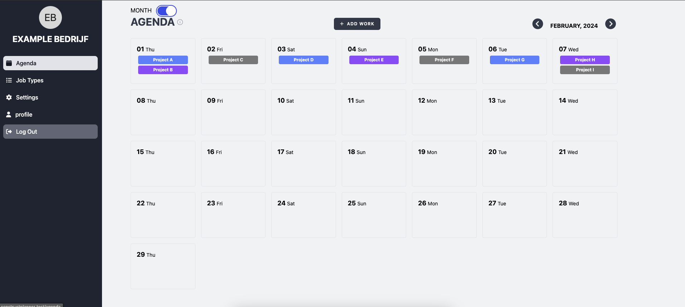
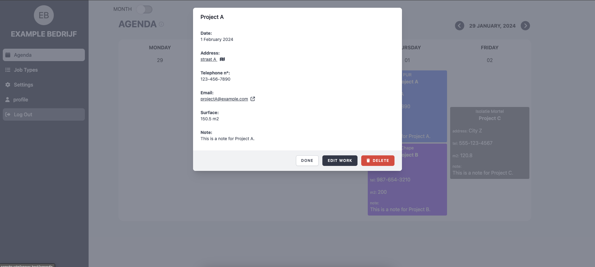
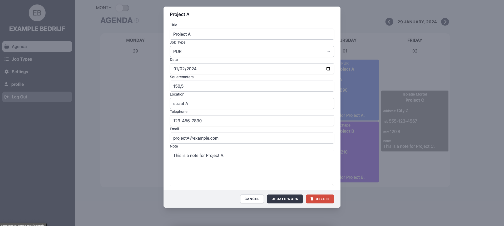
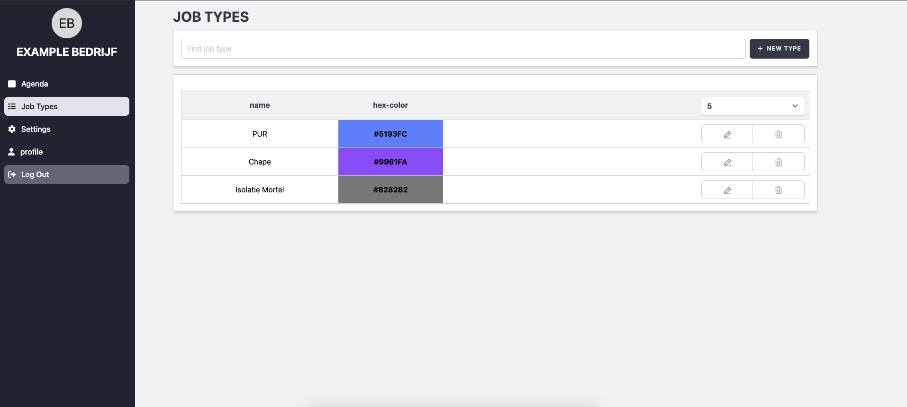
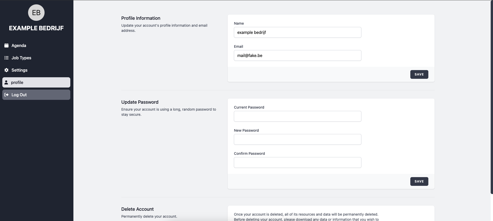

# ServicePlanner
A small planning app for contractors in the construction sector

# Features:
- Plan your work
- Create/Read/Update/Delete work from the agenda
- assign colors to a certain type of work
- Weekly view (without the weekend days) & monthly view (with weekend days)
- address link that (when clicked on) routes you to a google maps with directions to your the address

# Known Issues:
- When you add a new 'work' and switch from agenda view. You first have to switch pages or refresh before the 'work' appears
- Forgot Your password doesn't work (email service is not set)
- settings page is empty (no use for it yet...)

# development environment:
- MacBook Pro 2022 M1
- Herd (running PHP 8.2)
- DBngin (MySQL database on port 2200)

**Note:**
> When installing the environment, make sure to add the path to your project directory to herd.
  
# some Screenshots:
 
 
 
 
 
 
 
